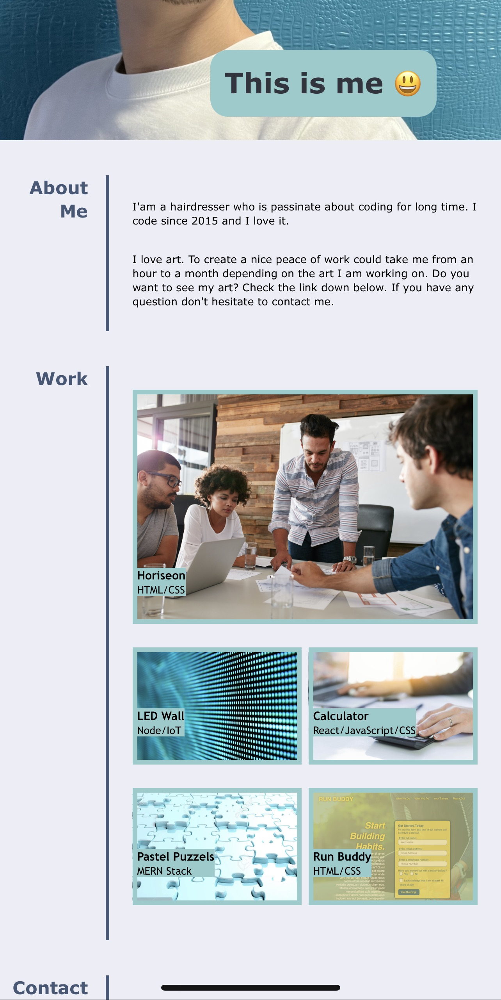

# Stepan Matysik's Portfolio project
> Portfolio project. A website with information about my projects.
> Live demo [_here_](https://elfsvet.github.io/stepan-matysik-portfolio-project/). 

## Table of contents
* [General info](#general-info)
* [Technologies](#technologies)
* [Setup](#setup)
* [Features](#features)
* [Screenshots](#screenshots)
* [Usage](#usage)
* [Project Status](#project-status)
* [Room for Improvement](#room-for-improvement)
* [Acknowledgements](#acknowledgements)
* [Contacts](#contact)


## General Info
This project is simply a webpage about me.
It demonstrates my skills, my project and contact information.

## Technologies
Project is created with:
- HTML
- CSS

## Setup
To open this project in vscode using git in Terminal/Git Bash:

```
$ mkdir portfolio_project
$ cd portfolio_project
$ git clone https://github.com/elfsvet/stepan-matysik-portfolio-project.git
$ code .
```

## Features
- Hyperlinks
- Hover
- Adjusting webpage for different screen sizes
## Screenshots



## Usage
For informative and interactive purpose only

## Project Status
Project is: _complete_

## Room for Improvement
To do:
- Need to have a privacy policy page.
- Can have different, more unique styling.

## Acknowledgements
- This project was inspired by UM Coding Boot Camp
- This project was creating from scratch using a gif picture.

## Contact
Created by [@elfsvet](https://github.com/elfsvet)
- [LinkedIn](https://www.linkedin.com/in/stepanmatysik/)
